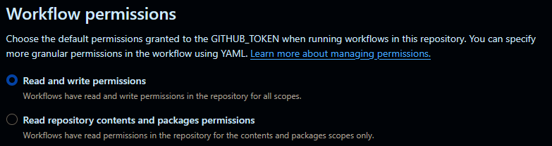

# Matt Components
A set of common components for stuff I'm building.

# GitHub Actions—Website Deploy Pipeline
The [main.yml](./.github/workflows/main.yml) script which defines the documentation build pipeline. To get this to work, 
you might have to change the permissions allocated to the GitHub Actions runner on a per-repository level. This can be 
found in (Repository Settings > Code and Automation > Actions > General > Workflow Permissions > enable `Read and write permissions`)



# GitHub Actions—Release Pipeline
You may get a failure on the NPM publish step if you copy the pipeline YML file, something similar to:
```
Error: NpmCallError: Call to "npm publish" exited with non-zero exit code 1
npm notice Publishing to https://npm.pkg.github.com with tag latest and default access
npm error code E404
npm error 404 Not Found - PUT https://npm.pkg.github.com/customcomponents
npm error 404
npm error 404  'customcomponents@0.0.0' is not in this registry.
npm error 404
npm error 404 Note that you can also install from a
npm error 404 tarball, folder, http url, or git url.
npm error A complete log of this run can be found in: /home/runner/.npm/_logs/2025-06-25T11_05_21_814Z-debug-0.log
```

To resolve this, prefix the package.json 'name' field with your GitHub name, e.g. `@mattpchoy/customcomponents`